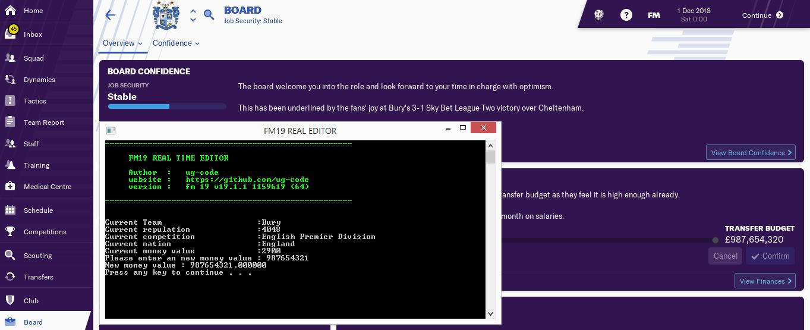

[](https://isocpp.org/)

# fm19rte

Read and write memory for FM19 (Football Manager 2019)


## Support
fm 19 v19.1.1 1159619 (64)



## Usage
```c++
HANDLE phandle = GameLoad(windowName);
ServiceClub serviceClub;
cout << "Current Team                    :" << serviceClub.getClubFullname(phandle) << endl;
cout << "Current repulation              :" << serviceClub.getClubReputation(phandle) << endl;
cout << "Current competition             :" << serviceClub.getClubCompetition(phandle) << endl;
cout << "Current nation                  :" << serviceClub.getClubNation(phandle) << endl;
cout << "Current money value             :" << serviceClub.getClubMoney(phandle) << endl;
cout << "Please enter an new money value : ";
cin >> newMoney;
serviceClub.setClubMoney(phandle, newMoney);
```

## Cheating
#### Current Team
- Money base Address : 0x1469B91F0;
- Money base Offset  :{ 0x0,0x50,0x70,0x148,0x67C };


## Features

  - Add My Current Club section
  - Add Average Attendance to Club section
  - Add Minimum Attendance to Club section
  - Add Maximum Attendance to Club section
  - Add Tactical Attributes (including Formations) to Club section
  - Add Full Name to Player section
  - Add Morale to Player section


##  Changes Log:

  - v1.0 - Released 02-Feb-2019 
  - Added Money
  -First realeased
}
## 🙌 Contribution

- Open pull request with improvements
- Discuss ideas in issues


